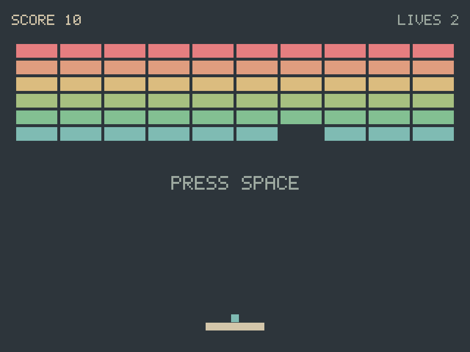
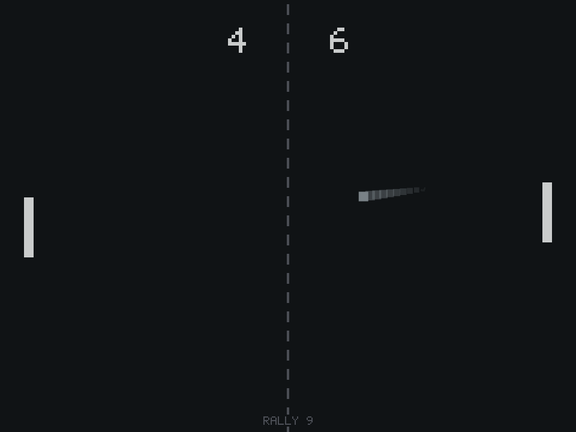
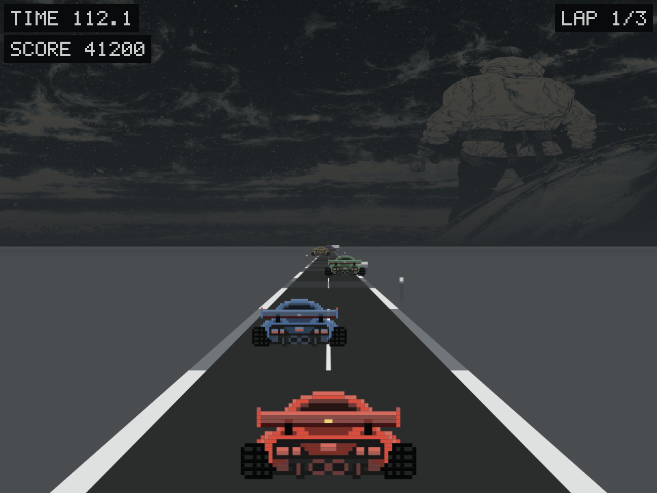

# Omarcade

Original retro arcade games, native to [Omarchy](https://omarchy.org/).

Not emulation and not clones of anyone's ROMs — small games written from
scratch in Rust, drawing straight into a pixel buffer, that read your active
Omarchy theme and idle at roughly nothing when you're not playing.

**Status:** early, but real. Three games (Pixel Break, Volley and Omaprix, a
pseudo-3D racer) are playable and tested, the shared engine underneath them
is the actual work, and the cabinet — a marquee in the Omarchy bar that opens
into an upright arcade machine you walk with the arrow keys — is live.



*Pixel Break, drawing itself in the active Omarchy theme.*



*Volley, mid-rally. Both images were produced by the games' own headless
renderers, not screenshotted from a window.*

---

## Install

```bash
omarchy plugin add https://github.com/RidgetopAi/omarcade.git --enable
```

That puts the cabinet in your bar. Open it and it will offer to build the
games — three Rust binaries, a couple of minutes, no root and nothing outside
your own home directory.

You need [Rust](https://rustup.rs) for that build (`sudo pacman -S rust` on
Arch). The cabinet checks, and tells you if it's missing rather than guessing.

### Just the games, no bar widget

```bash
git clone https://github.com/RidgetopAi/omarcade.git
cd omarcade
./packaging/install.sh
```

Same build, run directly. It installs the binaries to `~/.local/bin` and adds
a desktop entry per game so they show up in your app launcher.

### Removing it

```bash
omarchy plugin remove ridgetopai.omarcade   # the cabinet
./packaging/install.sh --uninstall          # the games
```

Either way your high scores are left alone, in
`~/.local/state/omarcade/`. Delete that directory if you want them gone too.

### Hyprland window rules (recommended)

Omarcade renders a fixed 4:3 canvas, so a tiling layout stretches the window
and grows the letterbox bars. These rules float it at its native size and
opt out of Omarchy's default translucency, which would otherwise wash out
the theme colours:

```bash
cp packaging/hyprland/omarcade.lua ~/.config/hypr/omarcade.lua
echo 'require("hypr.omarcade")' >> ~/.config/hypr/hyprland.lua
```

---

## Pixel Break

```bash
omarcade-pixel-break
```

| Key | Action |
| --- | --- |
| `←` `→` or `A` `D` | Move the paddle |
| `Space` | Launch the ball / start |
| `Enter` | Play again, once you've won or lost |
| `Esc` | Quit |

Ten levels, three lives. The ball's angle depends on where it hits the
paddle, so you steer it rather than just blocking it.

Armoured bricks arrive at level eight and take more than one hit. Four things
drop from what you break: a wider paddle, a **bomb** that narrows it — the only
bad one — a **magnet** that sticks the next catch to the paddle until you let
go, and an **Omarchy** that puts another ball on the field.

---

## Volley

```bash
omarcade-volley
```

| Key | Action |
| --- | --- |
| `↑` `↓` | Move the paddle / choose a difficulty |
| `Space` | Start / serve |
| `Enter` | Play again, once the match is over |
| `Esc` | Quit |

First to eleven. Three difficulties, and they change what you can see: a
smaller paddle and a faster ball, not a hidden number. The rally itself
speeds up the longer it runs.

The opponent predicts where the ball will arrive — simulating it forward
through wall bounces — and then gets that prediction wrong on purpose. It
aims off, it only re-decides every so often, and on the lower settings it
cannot read a shot that banks twice. The point is that it misses because it
**committed to the wrong place**, not because it was too slow, so a miss is
something you can watch happen and feel you caused.

How good it actually is, measured over sixty matches per cell against
scripted players of a fixed standard:

| | vs poor | vs fair | vs good |
| --- | --- | --- | --- |
| **Easy** | 97% | 15% | 0% |
| **Normal** | 100% | 65% | 0% |
| **Hard** | 100% | 97% | 25% |

Run it yourself: `cargo run --release -p omarcade-volley --example probe_ai`.

---

## Omaprix

```bash
omarcade-racer
```

| Key | Action |
| --- | --- |
| `←` `→` | Steer |
| `↑` | Throttle |
| `↓` | Brake |
| `Enter` | Start, and race again once it's over |
| `Esc` | Quit |

A pseudo-3D racer, drawn the way the arcade did it before 3D hardware: a road
built from bands of colour that scroll toward you, with hills and curves that
exist only as numbers per band.

You get a qualifying lap first. Beat the cut — 25% off the pace of a
physics-exact reference driver — and you take a grid slot; miss it and you
don't start. Then three laps where the **clock**, not the traffic, is what
beats you. Checkpoints twice a lap top it back up, so being quick buys you
the time to keep being quick.



*Omaprix, mid-race. The sky is your actual Omarchy wallpaper, sampled and
blurred at start-up — so the game sits under the desktop you already chose.*

---

## The cabinet

Installing the plugin puts a marquee in your Omarchy bar showing the best
score across every game. Click it and it opens an upright arcade cabinet:
one machine at a time, its screen showing that game, its control panel
showing your high scores for it. Arrow keys walk the aisle, `Enter` drops a
coin.

The screens are not screenshots. Each one is a frame rendered by that game's
own headless renderer, so the picture on the cabinet cannot drift from what
the game actually looks like.

---

## Why a suite

Most small arcade projects ship one game in one repo and stop. Omarcade is
built the other way round: a shared engine (`omarcade-core`) with games as
thin crates on top, and a **cabinet** in the Omarchy bar that knows about all
of them at once.

That's the part nobody else in the ecosystem has. Theme-reactivity and
native Wayland are table stakes here; a coherent suite is not.

---

## Architecture

Games never touch Wayland, GPU, or windowing types. They see two things:

```rust
trait Game {
    fn on_input(&mut self, event: InputEvent) -> bool;
    fn update(&mut self, dt: f32);
    fn render(&mut self, canvas: &mut Canvas<'_>);
}
```

...and a `Canvas` to draw into. The backend behind that seam is swappable —
today it's winit + softbuffer; a layer-shell backend (games rendered onto
the desktop surface, behind your windows) is the planned deep dive.

The seam is enforced by the build, not by discipline: a game crate that
tries `use winit::window::Window;` fails to compile.

```
core/src/backend/mod.rs         the seam: Canvas, Color, Key, InputEvent, Game, Backend
core/src/backend/winit_soft.rs  winit + softbuffer implementation
core/src/geom.rs                Vec2, Rect, AABB overlap, collision axis
core/src/ease.rs                easing curves, lerp, Decay
core/src/scores.rs              the score contract the cabinet reads
core/src/theme.rs               reads your live Omarchy palette, always falls back
core/src/backdrop.rs            reads your wallpaper, for the racer's sky
core/src/audio/                 mixer, ring buffer, the synthesis the games speak to
games/omarcade-pixel-break/src/
  state.rs     world model, no behaviour
  physics.rs   fixed 240Hz timestep + collision — the only file that advances time
  items.rs     what drops when a brick breaks
  render.rs    letterboxed viewport, bitmap-font HUD
  main.rs      wiring
games/omarcade-volley/src/
  state.rs     world model, difficulty tiers, no behaviour
  physics.rs   fixed 240Hz timestep, paddle steering, the rally ramp
  ai.rs        the opponent: predict, then get it wrong on purpose
  render.rs    letterboxed viewport, centre net, difficulty select
  main.rs      wiring
games/omarcade-racer/src/
  road.rs      the road as bands: curve, hill, and the projection to screen
  race.rs      qualifying, the grid, the clock, the laps
  drive.rs     the car's physics — grip, slide, what the grass costs you
  traffic.rs   the cars you are overtaking
  structures.rs / scenery.rs   gantries, billboards, and what lines the track
  render.rs    the horizon, the sky, and everything between
  main.rs      wiring
Marquee.qml / Cabinet.qml / ScoreRecord.qml    the bar widget and the cabinet
```

`geom.rs` started inside the first game's crate. The second needed every line
of it unchanged, which is the test a shared crate has to pass to deserve
existing — so it moved to `core` rather than being copied.

Each game is its own process and its own window. That's forced rather than
chosen: Quickshell can't embed an external Wayland surface, so a game can't
live inside the bar — only the cabinet can.

---

## Development

```bash
cargo test --workspace     # 804 tests
cargo clippy --workspace
cargo run -p omarcade-pixel-break
```

The game is also driven headlessly, which is how it gets tested without a
compositor. `Canvas` wraps any `&mut [u32]`, so the same rendering and
physics run against a plain buffer:

```bash
# Simulate 200,000 physics ticks and report the outcome
cargo run -p omarcade-pixel-break --example simulate -- 200000

# Adversarial collision probes
cargo run -p omarcade-pixel-break --example probe_tunnel
cargo run -p omarcade-pixel-break --example probe_shallow

# Measure how good the Volley opponent actually is, per difficulty
cargo run --release -p omarcade-volley --example probe_ai

# Render any game state straight to a PNG
cargo run -p omarcade-pixel-break --example dump_frame -- midgame out.png
#   scenes: ready | playing | midgame | won | lost
cargo run -p omarcade-volley --example dump_frame -- rally out.png
#   scenes: select | serve | rally | matchpoint | won | lost
cargo run -p omarcade-racer --example dump_frame -- drive out.png
#   scenes: drive | race | qualify | grid | crash | clean
```

These are deterministic and run in milliseconds. They're the reason
gameplay changes can be verified without opening a window.

---

## Problems, questions, ideas

Open an issue: **[github.com/RidgetopAi/omarcade/issues](https://github.com/RidgetopAi/omarcade/issues)**

If something is broken, these lines make it much faster to fix — paste them
in and I'll know where to look:

```bash
git -C /path/to/omarcade rev-parse --short HEAD   # which build you have
hyprctl version | head -1
rustc --version
echo "$XDG_CURRENT_DESKTOP / $(uname -r)"
```

Bug reports are genuinely welcome, including "this looks wrong on my
machine" with a screenshot. Omarcade has been developed against one desktop,
one GPU and one set of themes; the first reports from anyone else's are the
most useful thing the project can get.

---

## Licence

MIT. See [LICENSE](LICENSE).
